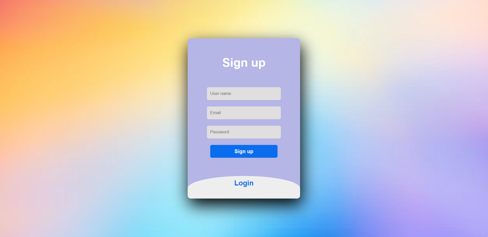
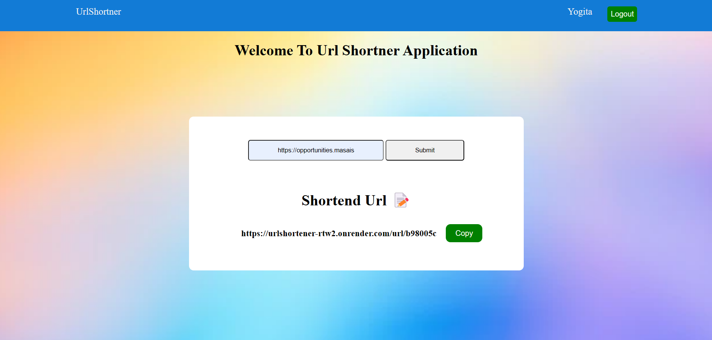

# URLshortener

#Frontend Deployed Link: https://65826f077549a72997dab16f--flourishing-taiyaki-88b8d4.netlify.app/
#Backend Deployed Link: https://urlshortener-rtw2.onrender.com/

Welcome to the URL Shortener web application! This project is designed to simplify the process of shortening long URLs, making them more manageable and shareable. Whether you need to share links on social media, in emails, or anywhere else, our tool streamlines the process.

## Features

- **User Login-signup**: User Registeration and Login to the application.
- **URL Shortening**: Easily convert long URLs into short, easy-to-share links.
- **User-Friendly Interface**: A simple and intuitive interface for a seamless user experience.

-**LoginPage**

- 

  -**Home Page**
  

## Technologies Used

- **Frontend**: Built with Html,css and javascript for a modern and responsive user interface.
- **Backend**: Utilizes Node.js and Express for the server and API functionality.
- **Database**: MongoDB is used to store and manage URL data.

## Usage

1. Register and login with user information.
1. Enter the long URL you want to shorten in the provided input field.
1. Click the "Submit" button to generate a short URL.
1. Copy and share the shortened URL with others.

## Installation

To run this project locally, follow these steps:

1. Clone the repository: `git clone https://github.com/Yogita2021/URLshortener`

   # For Backend

2. Backend: `cd Backend`
3. Install dependencies: `npm install`
4. Start the development server: `npm run start`

## Contact

Have questions or feedback? Feel free to reach out on [LinkedIn](https://www.linkedin.com/in/maneyogita/).

Thank you for using our URL Shortener web application!
